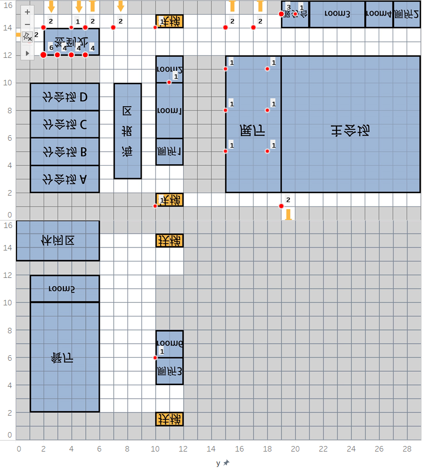

### day1会议日程安排分析 2019.5.20

---

- 共有五个出口：11505、11515、11517、10019

- 
1楼出现的拥挤情况（人数大于320）：

  

  <table width="256" cellspacing="0" cellpadding="0" border="0"><colgroup><col span="4" width="64"></colgroup><tbody><tr height="19"><th>11117</th><th>39160</th><th>10:52:40</th><th>407</th></tr><tr height="19"><td align="right" height="19">11117</td><td align="right">39220</td><td align="right" class="xl65">10:53:40</td><td align="right">396</td></tr><tr height="19"><td align="right" height="19">10910</td><td align="right">59320</td><td align="right" class="xl65">16:28:40</td><td align="right">386</td></tr><tr height="19"><td align="right" height="19">10910</td><td align="right">59260</td><td align="right" class="xl65">16:27:40</td><td align="right">369</td></tr><tr height="19"><td align="right" height="19">10910</td><td align="right">59380</td><td align="right" class="xl65">16:29:40</td><td align="right">364</td></tr><tr height="19"><td align="right" height="19">10910</td><td align="right">59200</td><td align="right" class="xl65">16:26:40</td><td align="right">359</td></tr><tr height="19"><td align="right" height="19">10710</td><td align="right">59320</td><td align="right" class="xl65">16:28:40</td><td align="right">337</td></tr><tr height="19"><td align="right" height="19">10910</td><td align="right">59140</td><td align="right" class="xl65">16:25:40</td><td align="right">330</td></tr><tr height="19"><td align="right" height="19">11117</td><td align="right">39100</td><td align="right" class="xl65">10:51:40</td><td align="right">323</td></tr><tr height="19"><td align="right" height="19">11117</td><td align="right">39280</td><td align="right" class="xl65">10:54:40</td><td align="right">320</td></tr></tbody></table>
  

- 7点开始有工作人员上班

- 7点到7点半工作人员在二楼room6集合休息，7点半后进入工作岗位

- 

- 8点开始签到

- 8点半开始进入主会场

- 9点10分到9点40分开幕致辞

- 10点到10点20分学术报告

- 10点半到10点50分茶歇

- 11点10分到11点50分学术报告

- 13点半开始新的人进入

- 14点开始分会场开放

- 14点10分到14点50分分会场A学术报告

- 15点到15点15分茶歇

- 14点10分到15点40分是B-D学术报告

- 15点30分到16点分会场A学术报告

- 16点15分到16点30分茶歇

- 16点45分到17点10分分会场A-D最后一次报告

- | 主会场 | 分会场A | 分会场B | 分会场C | 分会场D |
  | --- | ---- | ---- | ---- | ---- |
  | 1.5 | 1.58 | 1.9  | 1.9  | 1.9  |
