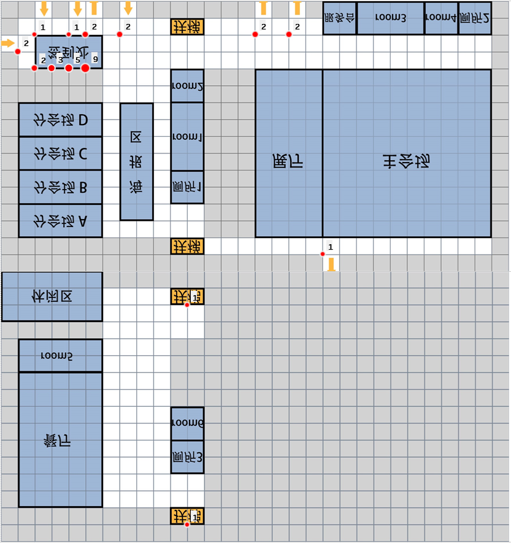

### day2日程分析 2019.5.22

---

- 拥挤情况：
  
  

  <table width="256" cellspacing="0" cellpadding="0" border="0"><colgroup><col span="4" width="64"></colgroup><tbody><tr height="19"><th>21405</th><th>59571</th><th>16:33:0</th><th>613</th></tr><tr height="19"><td align="right" height="19">21405</td><td align="right">59631</td><td>16:34:0</td><td align="right">611</td></tr><tr height="19"><td align="right" height="19">21405</td><td align="right">59691</td><td>16:35:0</td><td align="right">599</td></tr><tr height="19"><td align="right" height="19">21405</td><td align="right">59511</td><td>16:32:0</td><td align="right">580</td></tr><tr height="19"><td align="right" height="19">21405</td><td align="right">59751</td><td>16:36:0</td><td align="right">579</td></tr><tr height="19"><td align="right" height="19">21405</td><td align="right">59451</td><td>16:31:0</td><td align="right">469</td></tr><tr height="19"><td align="right" height="19">21405</td><td align="right">59811</td><td>16:37:0</td><td align="right">445</td></tr><tr height="19"><td align="right" height="19">11327</td><td align="right">38571</td><td>10:43:0</td><td align="right">419</td></tr><tr height="19"><td align="right" height="19">11117</td><td align="right">39171</td><td>10:53:0</td><td align="right">416</td></tr><tr height="19"><td align="right" height="19">11327</td><td align="right">38631</td><td>10:44:0</td><td align="right">409</td></tr><tr height="19"><td align="right" height="19">11117</td><td align="right">39231</td><td>10:54:0</td><td align="right">381</td></tr><tr height="19"><td align="right" height="19">11327</td><td align="right">38511</td><td>10:42:0</td><td align="right">378</td></tr><tr height="19"><td align="right" height="19">11221</td><td align="right">39831</td><td>11:4:0</td><td align="right">362</td></tr><tr height="19"><td align="right" height="19">11221</td><td align="right">39891</td><td>11:5:0</td><td align="right">357</td></tr><tr height="19"><td align="right" height="19">11221</td><td align="right">39771</td><td>11:3:0</td><td align="right">356</td></tr><tr height="19"><td align="right" height="19">11117</td><td align="right">39111</td><td>10:52:0</td><td align="right">352</td></tr><tr height="19"><td align="right" height="19">11327</td><td align="right">38691</td><td>10:45:0</td><td align="right">351</td></tr><tr height="19"><td align="right" height="19">11327</td><td align="right">38751</td><td>10:46:0</td><td align="right">345</td></tr><tr height="19"><td align="right" height="19">11327</td><td align="right">38451</td><td>10:41:0</td><td align="right">335</td></tr><tr height="19"><td align="right" height="19">11221</td><td align="right">33171</td><td>9:13:0</td><td align="right">327</td></tr><tr height="19"><td align="right" height="19">11327</td><td align="right">38811</td><td>10:47:0</td><td align="right">326</td></tr><tr height="19"><td align="right" height="19">11221</td><td align="right">33111</td><td>9:12:0</td><td align="right">322</td></tr></tbody></table>
  

- 

- 8点半开始签到

- 主会场9点开放

- 9点20分到9点40分第一次报告

- 10点到10点25分第二次报告

- 10点半到10点50分茶歇

- 11点10分到11点半第三次报告

- 11点50分到12点10分第四次报告

- 14点分会场开始开放

- 14点15分到14点50分分会场A第一次报告

- 15点到15点15分茶歇

- 14点15分到15点35分分会场B-D第一次报告

- 15点30分到16点分会场A第二次报告

- 16点半到17点茶歇

- 17点到17点15分分会场A-D最后一次报告

- 17点半到19点晚宴

- | 主会场 | 分会场A | 分会场B | 分会场C | 分会场D |
  | --- | ---- | ---- | ---- | ---- |
  | 1.4 | 1.1  | 1.58 | 1.58 | 1.58 |
