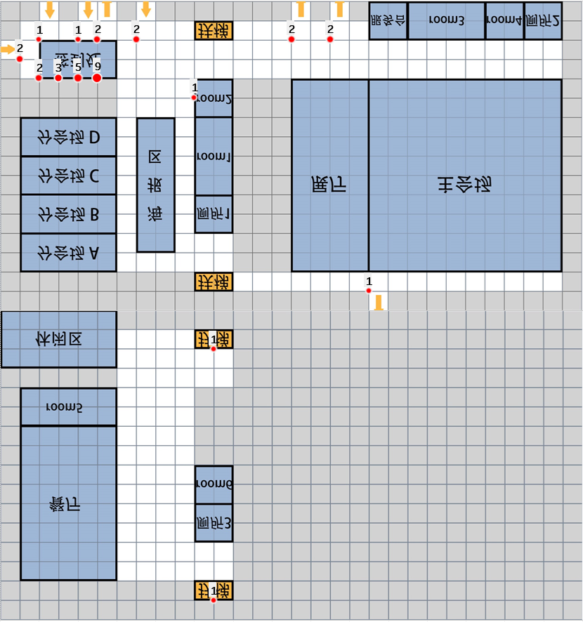

### day3日程分析 2019.5.23

---

- 

- 8点半开始签到

- 9点15分到9点35分主会场第一次报告

- 9点40分到10点20分分会场A第一次报告

- 9点50分到10点50分分会场B第一次报告

- 9点50分到10点50分分会场C第一次报告

- 10点到10点20分主会场第二次报告

- 10点半到10点45分茶歇

- 10点45分到11点10分分会场A第二次报告

- 11点到11点半主会场第三次报告

- 11点40分到11点50分主会场闭幕式

- | 主会场 | 分会场A | 分会场B | 分会场C | 分会场D |
  | --- | ---- | ---- | ---- | ---- |
  | 1.3 | 1.1  | 1    | 1    | 0    |
