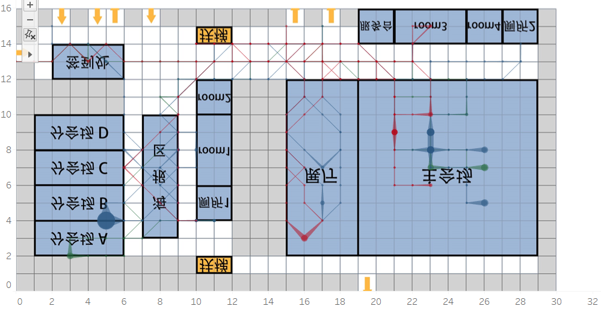

- 关于人员轨迹分析
  
  - 人员轨迹信息可以通过Tableau对轨迹进行记录
    
    
  
  - 如上图所示，此为id10750在1楼的轨迹图，其中颜色区分了是哪一天的轨迹，圆点的大小代表在该点的停留时间的多少，颜色的深浅代表该人移动到该店的次数的多少。
  
  - 人员共有10000人，无法对所有人都进行肉眼分析，所以需要进行聚类。

- 关于人员类型特点
  
  - 首先可以将人员分为参会人员和工作人员
  
  - 参会人员一般聚集处为主会场、展厅、分会场，而且分布较为分散
  
  - 工作人员一般聚集在工作地点，如签到处、服务台、餐厅等，而且分布较为集中
  
  - 如果轨迹过于集中在走廊中，且不会进入会议场所，则可能是安保人员
  
  - 如果轨迹聚集地分散在各类场所中，则有可能为媒体记者
  
  - 如果轨迹聚集地集中在海报区以及展厅，则有可能为参展单位

- 可以选用的特征
  
  - 标准差
  
  - 最大值
  
  - 位置

- 整个会议共出现了5256名不同id的人员

- 
  
  - staytime的峰值出现的位置和时间
  
  - staytime的峰值的大小

- 一楼地点分类
  
  - 签到处(1)：12<=x<14，2<=y<6
  
  - 分会场(2)：2<=x<10，1<=y<6
  
  - 海报区(3)：3<=x<10，7<=y<9
  
  - room1和room2(4)：6<=x<12，10<=y<12
  
  - room3和room4(5)：14<=x<16，21<=y<27
  
  - 厕所(6)：4<=x<6,10<=y<12或14<=x<16，27<=y<29
  
  - 扶梯(7)：1<=x<2或14<=x<15，10<=y<12
  
  - 服务台(8)：14<=x<16,19<=y<21
  
  - 展厅(9)：2<=x<12,15<=y<19
  
  - 主会场(10)：2<=x<12,19<=y<29

- 二楼地点分类
  
  - 休闲区(11)：13<=x<16,0<=y<6
  
  - room5(12)：10<=x<12,1<=y<6
  
  - 餐厅(13)：2<=x<10,1<=y<6
  
  - room6(14)：6<=x<8,10<=y<12
  
  - 厕所(15)：4<=x<6,10<=y<12
  
  - 走廊(16)：其余位置

- 接近9点时，人员活动量突然增加

- 9点时主会场开始进人

- 9点半分会场开始进人

- 11点后人员开始离开

- 使用K-means第一次聚类
  
  - 重复一百次聚类，取平均值，各个类别的人数如下：
    
    304
    
    442
    
    600
    
    870
    
    1348
  
  - 重复一百次聚类，取最接近上面平均值的一次结果，聚类中心如下：
    
    14922
    
    13901
    
    12906
    
    13154
    
    13741
