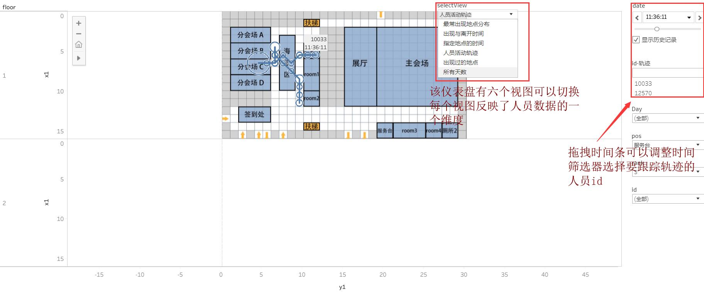
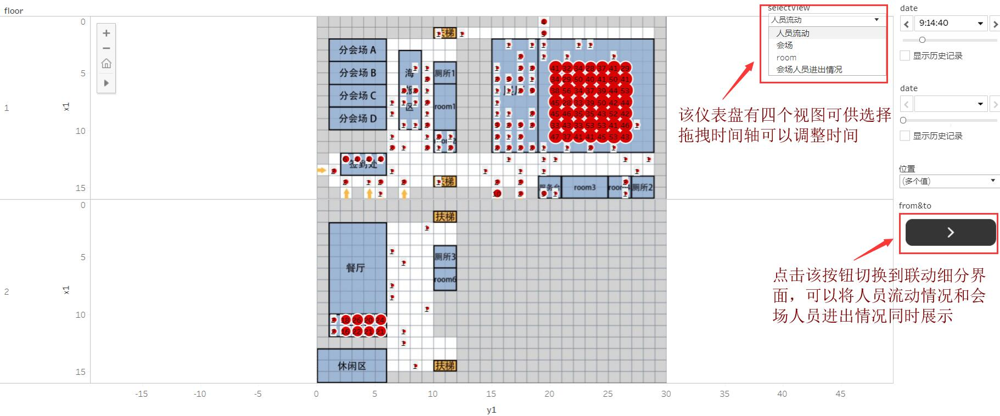
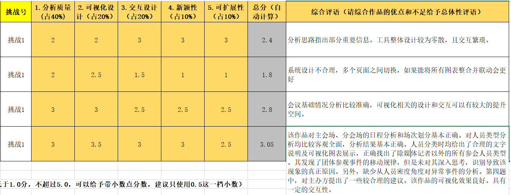

#### ChinaVis2019-Challenge1

 2019.6.28

---

##### 第一部分 网页部分

github page： [https://seriousaa.github.io/ChinaVis2019-Challenge1/](https://seriousaa.github.io/ChinaVis2019-Challenge1/)

目录

│  day1.json //第一天的人员特征记录

│  day2.json //第二天的人员特征记录

│  day3.json //第三天的人员特征记录

│  graph.js //负责生成力导向图的js脚本

│  graph5.json //力导向图的边权信息

│  graph_dist.json //力导向图的节点信息，包括类别、编号等

│  index.html //主界面

│  parallel.js //负责生成平行坐标系的js脚本

│  radar.js //负责生成雷达图的js脚本

│  radar.json //雷达图所用的每个人停留时间最长的地点以及对应停留时间记录

│  convert.py //将csv文件转换成json文件

│ css //Data按钮样式表

│ images //按钮图标

│ jquery //jquery库

│ jquery-SearchBar //基于jquery的搜索框插件库

│ layer //弹出页插件库

上图是网页的整体效果，主要分为三个板块：平行坐标图、力导向图与雷达图

---

##### 第二部分 Tableau部分

Tableau部分包括以下四个工作簿：

- 个人轨迹

- day1时间安排

- day2时间安排

- day3时间安排

- 所有的工作簿都发布在了 Tableau Public上，欢迎查看与下载 [https://public.tableau.com/profile/li1403#!/](https://public.tableau.com/profile/li1403#!/)

- Tableau在这里主要用于对人员轨迹进行分析以及对会议日程进行分析

下面对各个工作簿作简要说明：

- 上图为人员轨迹工作簿
- 上图为Day1时间安排工作簿
- 注意：Tableau Public加载视图容易卡顿，如果出现视图显示不全（筛选器不显示）的情况，可以多刷新几次，个人建议下载到本地进行查看

---

##### 第三部分 matlab部分

matlab由于对人员轨迹数据进行处理，以下将给出所用到的脚本：

- timetrack.m ，对题目给出的原始日志数据进行处理，得到每个人每天每分钟都在哪些地点

- sensor.m  ，对题目给出的传感器id按照所处的地点进行分类

- get_dist.m ，对得到的人员轨迹数据进行处理，以矩阵的形式输出每个人之间的**轨迹差别** （此处指两个人有多少分钟出现在了同一地点，需要考虑一天之内一个人出现而另一个人不出现的情况）

- matrix2links.m ，将得到的矩阵处理成source target value的形式

- 注意：比赛中实际用到的脚本数要大于上面列举的这些，但大多没什么难度，参考价值不是很大，所以没有赘述

---

##### 第四部分 Excel部分

除了matlab与python之外，对比赛数据的处理主要通过Excel来进行，下面给出最常用到的几项Excel功能：

- 筛选、排序、删除重复项

- vlookup函数

- 数据透视表

- 条件格式

由于有些数据过于庞大，不便单独上传，有需要的可以直接将Tableau工作簿中的数据源导出使用

---

##### 第五部分 参赛思路

整个比赛过程中的阶段性总结以及最后总结的论文，已经上传至GameIdeas目录下，有需要的朋友可以自行查看。

---
##### 赛后反思 2019.7.12

没得奖。。下图是评审人员给出的意见

找到二等奖开翼大佬的[github](https://github.com/Kaiyiwing/Chinavis2019)
对比一下，反思一下自己的缺陷

- 首先是视图功能混乱，不够直观，没有给评委展示清楚各个视图之间的联系

- 其次是heatmap还是有问题，只是对各个区域的人数变化进行了显示，人数一多，就容易糊在一块，
反观开翼的作品，他应该是采用的将每个人的位置映射成传感器区域的一个随机的小圆点，这样就显得稀疏分明，还可以看出人员流动的趋势

- 最大的问题可能就是，明明一个heatmap图就能解决的事，干嘛非得整这么多图，还浪费了那么多的时间精力。。真特么无语

- 但我感觉我们对于人员特征的提取是做得不错的，平行坐标系可以反映出很丰富的信息。
但是其余的两个图好像并没有起到什么作用，虽然那个力导向图看起来像是那么回事，也花了我不少时间，但是并没有解决什么实际上的问题

- 另外，我感觉我们的数据处理方式可能有些问题，我们为了方便直接按分钟取得位置，这样做的坏处就是人员流动不连贯，光感觉人在瞬移，不知道那么多人到底去了哪

- 我最后悔的一点是没有及时和老师沟通，导致一些思路上的问题没有发现。当时太贪多了，总想着做得差不多了再去找老师看，到最后都没挤出时间来。。这是比较遗憾的一点

---

联系方式：1094420986@qq.com
